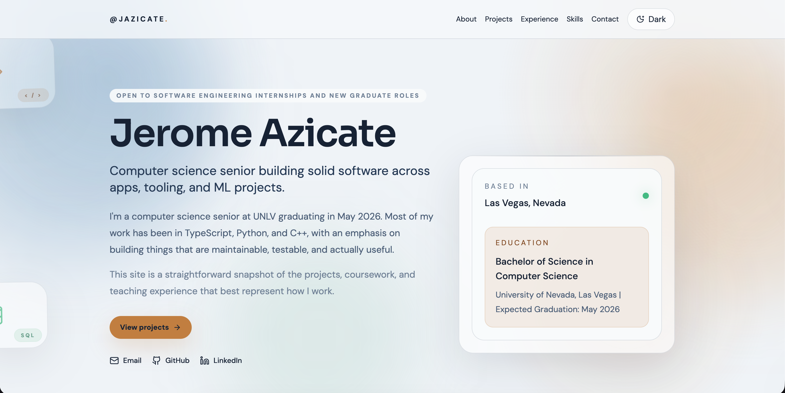

# Jerome Azicate Portfolio

Personal portfolio site for my software projects, experience, and coursework.

Live site: [jazicate.com](https://jazicate.com)

This project is a single-page React portfolio built to present my work without turning the site into a resume pasted onto the web. The content is intentionally direct: selected projects, teaching experience, core skills, and clear ways to get in touch.

## Demo



## What it includes

- A hero section with a short introduction, education details, and direct links
- A projects section with writeups for BatchGrade, SecureCrypto, and machine learning coursework
- An experience section focused on teaching assistant work at UNLV
- A skills section covering languages, frameworks, tools, and core CS topics
- A contact section with direct contact info and a simple form

## Tech stack

- React 19
- TypeScript
- Vite
- Tailwind CSS 4
- Framer Motion
- Lucide React
- Vercel

## Project structure

The site is built as a component-based React app, with most portfolio content stored in [`src/data/portfolioData.ts`](./src/data/portfolioData.ts). That keeps the copy, project entries, and experience details easy to update without rewriting the UI.

Key areas:

- `src/components/sections`: page-level sections like Hero, Projects, Experience, Skills, and Contact
- `src/components/project`: project card presentation
- `src/components/layout`: shared layout pieces like the navbar, footer, section wrappers, and background visuals
- `src/data/portfolioData.ts`: portfolio content and structured data

## Local development

```bash
npm install
npm run dev
```

Other useful commands:

```bash
npm run build
npm run lint
npm run preview
```

## Deployment

This portfolio is deployed on Vercel. Production builds are generated with Vite and published from this repository to the live site at [jazicate.com](https://jazicate.com).
